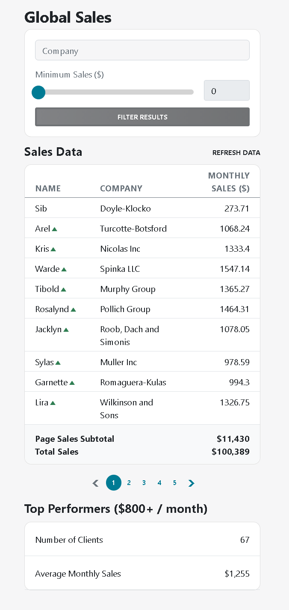

# Solution to tech assignment

To run the application

1. Checkout the project from github `git clone git@github.com:dhbalaji/sabre-dt-coding-exercise.git`

2. Change directory `cd sabre-dt-coding-exercise`

3. Install npm packages `npm i`

4. To run the application `npm start`

## Technical Notes

1. Used `react` for view layer & `bootstrap 5` for styling.

2. Have lifted state wherever possible and managed state with `react state` concept. 

3. `Redux is not used` because the application state management use case was not compelling like multiple screens, many components communicating with each other.

4. Used `react hooks` to build components.

5. Functional programming concepts like pure functions have been used to prevent `side effects`.

6. `sass` has not been used, bootstrap utility classes used wherever possible.

## Feature additions & corrections

1. Added `usability aspects` like, in place feedback when action is performed like filter results below the filter action button.

2. Added `currency symbol` along with numbers for page sales & total sales so that it represents monetary value at one glance. Same has been added in table header.

3. Used `standard formatting` for monetary number formatting instead of dot which was mentioned in mock up. It was confusing whether it was decimal point or formatting dot.

4. Added `configuration based` conditions for currency, number of rows, pagination pills count so that the app can be scaled easily.

## Config parameters used

- Page size for display - 10

- Currency for formatting and display of values - USD

- Top performer baseline value - 800

- Number of pills in the paging toolbar - 5

Visit [./src/config.js]()

## Other production grade features that are implemented

- Demonstrated how access privileges can be handled with help of HOC [./src/common/WithAccessChecks.js]()

- Used `adapter` module to convert response to match application requirements. The code in the adaptor is not re-rendered like the component code which improves the app `performance`

- Used `formatters` in one module to promote reuse and easy maintainability.

- API calls related methods are put in one module which can be moved to `redux middleware` when the application spans to multiple pages/screens.

- All utility, formatters, factory & adaptor methods are `pure functions`. This helps to reduce defects caused by `side effects`.

## Product backlog

The next steps to improve this application would be

1. Filter field values to be linked to URL so that the application state can be bookmarked or shared.

2. The design on the large screens can be enhanced. For example, the filter and top performer can be pulled to left and the data table on the right.

3. The layout shift on paging toolbar navigation can be avoided with some design modification like using ellipsis in table cell.

## Decisions made in the interest of time

As a senior dev, I try to adhere to best programming practices. However to finish the assignment on time, few compromises have been made

1. Unit testing has not been added to the codebase. Instead the application is manually tested for below scenarios

- Clean state where there is no data
- Data returned is ideal
- Data more than 100 rows.

2. Data sets in the tune of thousands of array items have not been dealt with. That calls for virtualized tables, memoizing and reduced looping to prevent slowness of the UI.

3. Lighthouse performance audits and web vitals are not prioritized.
